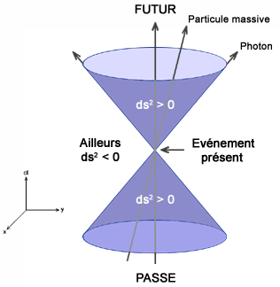

*Réponse publiée [sur Quora](https://fr.quora.com/Est-ce-que-la-th%C3%A9orie-de-la-relativit%C3%A9-implique-le-fait-quil-ny-a-pas-vraiment-de-pr%C3%A9sent-de-maintenant-tout-de-suite-universel-de-pr%C3%A9sent-absolu/answer/Dr-Goulu)*

Oui c'est ça. Supposons qu'en prenant une photo au flash de votre petite amie par une nuit romantique, il y ait un flash sur la Lune ( les [Impacts sur la Lune](w:), ça arrive…).

le flash de votre appareil photo et celui sur la Lune sont simultanés, puisqu'ils sont sur la même photo. Mais un astronaute sur la Lune verrait votre flash (avec un bon télescope…) à peu près deux secondes après l'impact sur la Lune : le présent n'est pas le même pour deux observateurs.

Tout ce que vous percevez comme "présent" dans le sens de "simultané à ce qui se passe ici" se trouve en fait sur le [Cône de lumière](w:) du passé, où se trouvent tous les événements à une distance d telle que la lumière a mis un temps t=d/c à vous parvenir (c étant la "vitesse de la lumière", mais aussi celle de l'information) :

Chaque observateur ayant un cône de lumière différent, il a un "présent" différent. Mais quand tout est calme (en relativité restreinte), on peut encore utiliser la [Synchronisation d'Einstein](w:), qui s'était déjà posé la question, pour définir une référence de temps commune à plusieurs observateurs, qui se retrouveraient donc avec un "décalage horaire" par rapport à un temps "absolu" défini arbitrairement, un peu comme sur Terre avec les fuseaux horaires par rapport à l'heure GMT.

Ca se complique dans des conditions moins calmes (en relativité générale), quand on accélère ou qu'on se trouve à proximité de très grosses masses. Là, les cônes de lumière se déforment, ou plutôt apparaissent déformés pour des observateurs externes : la seconde ne dure plus une seconde pour tout le monde, les mètres n'ont plus la même longueur dans les différentes directions et il n'y a plus moyen de synchroniser des horloges simplement : même en étant au même endroit de l'espace, un observateur rapide n'aura pas le même cône de lumière qu'un observateur lent.

Après un voyage dans l'espace, l'observateur rapide reviendra sur Terre comme Phileas Fogg, en ayant voyagé pendant un temps différent de ceux restés sur place.

Cet effet se mesure désormais avec deux horloges atomiques dans le même laboratoire et permet de l'affirmer : vos pieds sont plus jeunes que votre tête : vous n'avez pas d'âge absolu, le présent de vos pieds n'est pas celui de votre tête.
