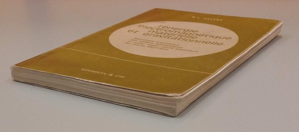

*Réponse publiée [sur Quora](https://fr.quora.com/Quelles-remarques-peut-on-faire-des-livres-l-%C3%A9nergie-%C3%A9lectromagn%C3%A9tique-mat%C3%A9rielle-et-gravitationnelle-de-R-Vall%C3%A9e/answer/Dr-Goulu)*

La [Théorie synergétique](w:)est du grand n'importe quoi que toutes les expériences ont réfuté.

Mais puisque la question porte sur les livres

Je trouve qu'ils ont une couverture horrible qui ne donne pas envie de les lire.
