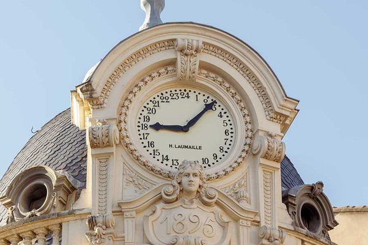

*Réponse publiée [sur Quora](https://fr.quora.com/La-terre-tourne-sur-elle-m%C3%AAme-d-est-en-ouest-Pourquoi-les-aiguilles-d-une-montre-tournent-d-Ouest-en-Est-et-qui-qui-en-a-fait-le-choix/answer/Dr-Goulu)*

Le cadran solaire.

Normalement cette réponse devrait suffire en vous faisant réfléchir un peu ;-)

Si vous ne voyez toujours le rapport, j'ajoute un indice : les premières horloges avaient un cadran de 24h comme celle-là :

Regardez bien : midi est en bas, au sud, là où est le soleil à midi …
