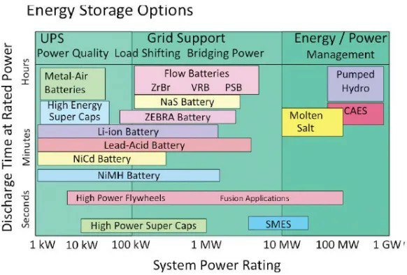

*Réponse publiée [sur Quora](https://fr.quora.com/Comment-pourrait-on-stocker-l-%C3%A9lectricit%C3%A9-par-des-moyens-autres-que-chimiques-du-type-pomper-l-eau-d-un-lac-inf%C3%A9rieur-vers-un-lac-sup%C3%A9rieur-quand-on-produit-trop-d-%C3%A9lectricit%C3%A9-soulever/answer/Dr-Goulu)*

On peut faire tout ça. Chaque technique a ses avantages et inconvénients. La figure ci-dessous les positionne en fonction de la puissance nominale et du temps de décharge.

[https://www.drgoulu.com/2012/10/...](/2012/10/07/comment-stocker-lenergie/)
