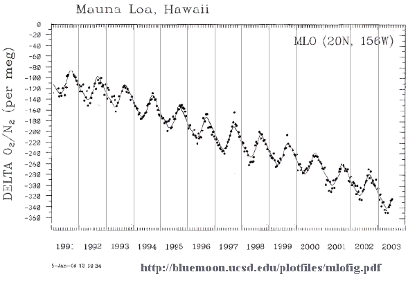

*Réponse publiée [sur Quora](https://fr.quora.com/Pourquoi-le-taux-doxyg%C3%A8ne-ne-varie-pas-sur-Terre/answer/Dr-Goulu)*

Il varie. Actuellement il est en baisse régulière:

(données plus récentes et plus dispersées sur la planète ici [[1]](#UVfJm)

La baisse correspond à l'augmentation du CO2, avec quelques phénomènes dynamiques décrits ici : [Les variations atmosphériques du CO2 et de l'O2](http://acces.ens-lyon.fr/acces/thematiques/CCCIC/ccc/atmosphere/atm_synth)

D'ailleurs l'oscillation annuelle du taux de O2 correspond exactement, inversée, à celle du CO2, liée au cycle annuel de la photosynthèse terrestre (belle saison de l' hémisphère nord) et de la respiration (saison froide de l' hémisphère Nord)

Notes de bas de page

[[1]](#cite-UVfJm)[http://bluemoon.ucsd.edu/images/...](http://bluemoon.ucsd.edu/images/ALLo.pdf)
