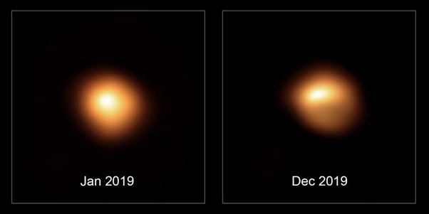

*Réponse publiée [sur Quora](https://fr.quora.com/Avons-nous-d%C3%A9j%C3%A0-observ%C3%A9-les-surfaces-d%C3%A9taill%C3%A9es-d-%C3%A9toiles-en-dehors-de-notre-syst%C3%A8me-solaire/answer/Dr-Goulu)*

pas très détaillées, mais on distingue des irrégularités à la surface de Bételgeuse par exemple.

[Bételgeuse : que nous révèle cette nouvelle image de la supergéante rouge ?](https://www.futura-sciences.com/sciences/actualites/etoile-betelgeuse-nous-revele-cette-nouvelle-image-supergeante-rouge-79617/)
