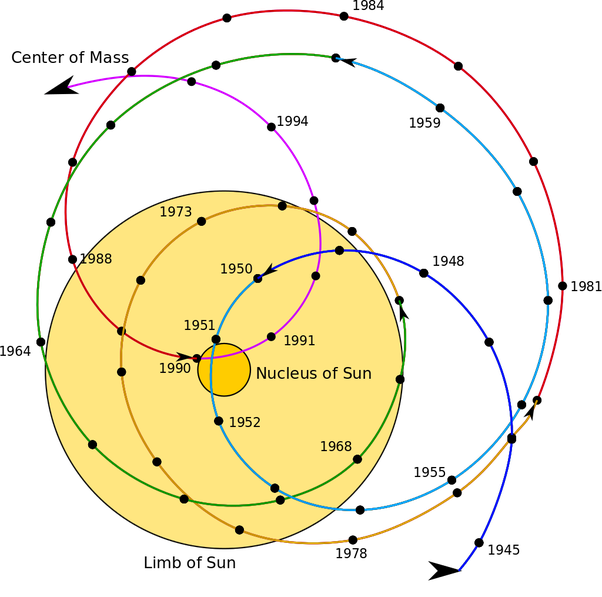

*Réponse publiée [sur Quora](https://fr.quora.com/Est-ce-quil-sest-d%C3%A9j%C3%A0-produit-un-alignement-du-centre-de-gravit%C3%A9-de-chacune-des-plan%C3%A8tes-du-syst%C3%A8me-solaire-Quand-Que-sest-il-pass%C3%A9-Que-se-passerait-il-si-cela-devait-arriver-un-jour/answer/Dr-Goulu)*

Rien que pour contredire mes petits camarades, je vais répondre "oui" à la question telle que je l'ai mal comprise :-)

En effet [le centre de gravité du système solaire](w:Coordonnées_barycentriques_(astronomie)) se promène pas mal, et assez vite:

Comme on le voit ci-dessous, il est passé "assez près" du centre du Soleil à 40 ans d'intervalle, en 1951 et en 1990 :

Donc oui, il arrive assez souvent que les effets gravitationnels des planètes se compensent à peu près.

Selon [le Soleil et le climat](http://la.climatologie.free.fr/soleil/soleil1.htm) cette année 2021 la position du centre de gravité sera proche de son maximum à l'extérieur du soleil, ce qui correspond à un alignement approximatif des 4 planètes géantes gazeuses
