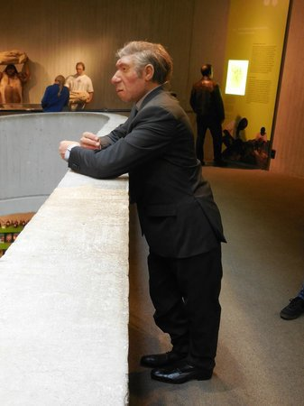

*Réponse publiée [sur Quora](https://fr.quora.com/Si-les-N%C3%A9andertaliens-%C3%A9taient-encore-vivants-se-trouveraient-ils-dans-des-zoos-humains/answer/Dr-Goulu)*

Il y en a un au [Musée de l'Homme de Néandertal](w:) en Allemagne :

vous passez à côté en le trouvant un peu bizarre (surtout parce que c'est une statue), mais franchement vous pourriez le croiser dans la rue sans le remarquer.

On les aurait peut-être exhibés dans certaines foires et à l'exposition universelle de Paris de 1898 à côté du "village nègre", mais même pas sûr car ils étaient (très probablement) "blancs"…

En fait, peut-être que s'ils avaient survécu, le racisme aurait été assez différent…

En tout cas ils ne se laisseraient certainement pas enfermer dans des zoos. Y voir des cousins de 3 millions d'années nous fait déjà de la peine, alors imaginez des cousins de 100'000 ans …
