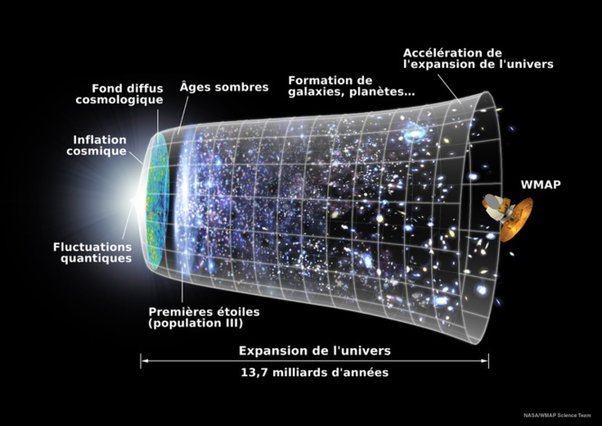

*Réponse publiée [sur Quora](https://fr.quora.com/Comment-nous-sommes-nous-rendues-compte-que-l-Univers-%C3%A9tait-en-constante-expansion/answer/Dr-Goulu)*

En **expansion**, par le [décalage vers le rouge](w:) :

> En [1929](w:), après une longue série d'observations, l'astronome [Edwin Hubble](w:) (en collaboration avec [Milton Humason](w:)) énonça la [loi de Hubble](w:).
>
>
>
> Il apparaît que la lumière en provenance des [galaxies](w:Galaxie) distantes subit, en moyenne, un décalage vers le rouge proportionnel à leur distance. L'effet s'observe en moyenne : on observe des galaxies dont la lumière est plus ou moins décalée vers le rouge, ou même décalée vers le bleu, comme la [galaxie d'Andromède](w:).
>
>
>
> En appliquant l'hypothèse que cela provient d'un mouvement de la source, par effet Doppler, on en a déduit que, en moyenne, les sources s'éloignent de nous d'autant plus vite qu'elles sont déjà plus loin.
>
>
>
> (Wikipédia)

Par contre, cette expansion n'est **pas constante**. Logiquement, elle devrait "ralentir" du fait de l'attraction gravitationnelle entre les galaxies, ce qui a donné assez tôt l'idée d'Univers cycliques, ou un [Big Crunch](w:) précéderait un nouveau Big Bang. Et il semblerait bien que ce fusse* le cas, il y a longtemps.

Mais en 1998, grosse surprise, des mesures récompensées par le Prix Nobel de Physique en 2011 montrent que [l'expansion accélère](w:Accélération_de_l'expansion_de_l'Univers) !

Ce phénomène a introduit l'idée d'une "[énergie noire](w:)" remplissant l'Univers et se comportant comme une force gravitationnelle répulsive. Celui qui trouve ce que c'est gagne un autre Prix Nobel, promis juré ([je sais comment faire…](/2017/09/20/proposer-ig-nobel/#.YD5nu2hsOCo))

Le BigBang et son "inflation", puis le ralentissement de l'expansion et l'accélération subséquente** ainsi que plein d'autres choses cosmologiques font l'objet de [mon image de profil](/2008/05/30/le-big-bang-en-une-image/#.YD5ohmhsOCo), dont voici la version avec texte en français que je viens de trouver:

(* et un imparfait du subjonctif de plus… J'espère qu'il est correct…)

(** je suis en forme ce soir…)
