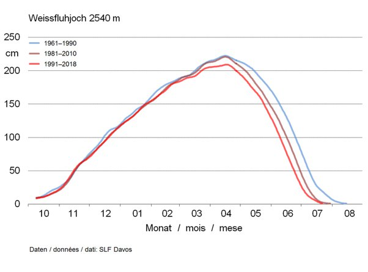

*Réponse publiée [sur Quora](https://fr.quora.com/La-neige-sera-t-elle-amen%C3%A9e-%C3%A0-dispara%C3%AEtre-%C3%A0-cause-du-r%C3%A9chauffement-climatique/answer/Dr-Goulu)*

Il se passe quelque chose d'assez étonnant selon les mesures de MétéoSuisse sur presque un siècle:

- les premières neiges ne sont pas plus tardives

[https://www.meteosuisse.admin.ch...](https://www.meteosuisse.admin.ch/home/climat/climat-de-la-suisse/informations-saisonnieres/premiere-neige.html)

- mais il y a tout de même moins de neige en moyenne : l'isotherme du zéro degré en hiver est monté de 600m à 850m en 50 ans

[https://www.meteosuisse.admin.ch...](https://www.meteosuisse.admin.ch/home/climat/climat-de-la-suisse/informations-saisonnieres/premiere-neige.subpage.html/fr/data/blogs/2019/4/immer-weniger-schnee.html)

ça touche beaucoup la "moyenne montagne" , moins la haute montagne où on constate tout de même une fonte plus rapide au printemps. Sur une station de mesure à 2540m, on a perdu pratiquement un mois d'enneigement (Juillet) en 50 ans :

Bref, pour skier il faudra monter à 2000m ou plus …
