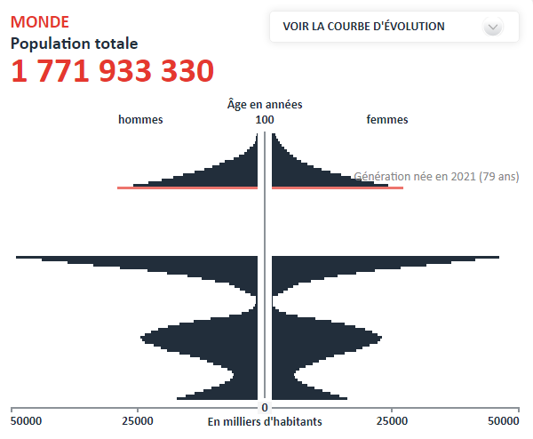

*Réponse publiée [sur Quora](https://fr.quora.com/Une-st%C3%A9rilisation-massif-de-toute-la-population-terrestre-durant-une-ou-deux-g%C3%A9n%C3%A9rations-sauvera-la-terre-et-les-humains/answer/Dr-Goulu)*

Essayez le

[https://www.ined.fr/_modules/Sim...](https://www.ined.fr/_modules/SimulateurPopulation/?lang=fr)

en ayant 0 enfants pendant deux générations, l'humanité s'éteint puisque toutes les femmes sont ménopausées après.

Pendant une génération, on frôle l'extinction et ça repart avec de fortes oscillations de la pyramide des âges créant des troubles sociaux et économiques très importants.

En 2100 ça donne ça :

Et rien n'empêchera la natalité de remonter plus haut que 2.4 pour repeupler tout ça en 1 ou 2 siècles.

La planète ne court aucun danger, avec ou sans humains.
