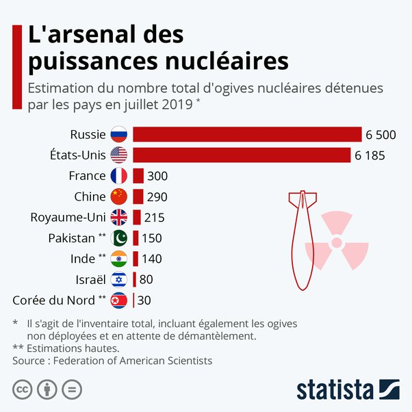

*Réponse publiée [sur Quora](https://fr.quora.com/Quelle-est-la-base-de-calcul-et-le-nombre-minimum-darmes-nucl%C3%A9aires-pour-emp%C3%AAcher-le-chantage-nucl%C3%A9aire-des-%C3%89tats-Unis-ou-de-la-Russie-Pourquoi-le-Royaume-Uni-la-France-et-la-Chine-ont/answer/Dr-Goulu)*

Il suffit de pouvoir assurer en faire péter une seule sur une ville ennemie.

Le problème n'est pas le nombre de bombes mais les "[vecteurs nucléaires](w:Vecteur_nucléaire)". Disposer d'un missile, un bombardier ou un sous-marin capable d échapper aux défenses des USA ou de la Russie est loin d'être évident. Il faut en avoir beaucoup, de plusieurs types pour avoir une "chance" d'amener une bombe sur une cible.

Les "petites" puissances nucléaires ont une dissuasion efficace contre leurs voisins, ou des armes tactiques contre des cibles militaires, pas contre les 2 grandes puissances.

