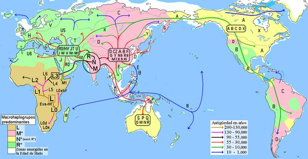

*Réponse publiée [sur Quora](https://fr.quora.com/Comment-des-Hommes-ont-ils-pu-se-retrouver-en-Am%C3%A9rique-si-lesp%C3%A8ce-humaine-est-n%C3%A9e-en-Afrique-et-que-la-travers%C3%A9e-des-Oc%C3%A9ans-repr%C3%A9sentait-il-y-a-des-milliers-dann%C3%A9es-une-prouesse-qui/answer/Dr-Goulu)*

voir

[https://fr.wikipedia.org/wiki/Pr...](w:Premier_peuplement_de_l'Amérique)

pendant la dernière glaciation, le niveau des océans était environ 100m plus bas que maintenant. On sait que les chevaux passaient à pattes d'un continent à l'autre dans cette région[[1]](#ZbUcg) jusqu'à il y a 11'600 ans.

Les hommes étaient des nomades suivant les troupeaux, source inépuisable de bonne viande et de peaux, il est donc tout à fait imaginable qu'ils aient donc passé en Amérique sans même s'en apercevoir.

Les études génétiques des populations autochtones permettent de retracer ces migrations, et de voir que l'Amérique a été colonisée par plusieurs groupes humains distincts, probablement en 3 vagues :

Notes de bas de page

[[1]](#cite-ZbUcg)[Histoire évolutive des Équidés](w:)
