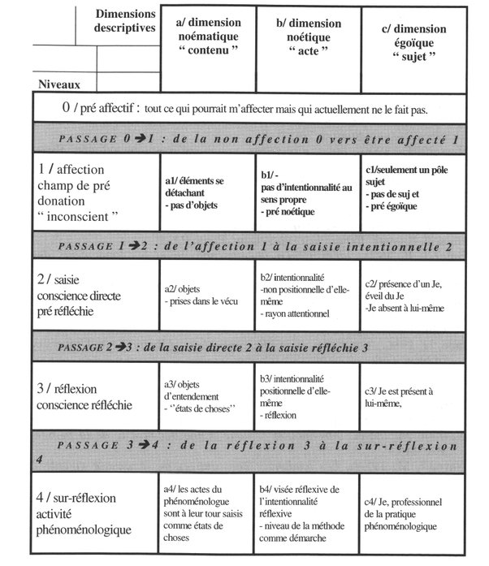

*Réponse publiée [sur Quora](https://fr.quora.com/Quelle-est-la-diff%C3%A9rence-entre-la-conscience-r%C3%A9fl%C3%A9chie-et-la-conscience-spontan%C3%A9e/answer/Dr-Goulu)*

encore une distinction de philosophes au sujet de choses dont ils n'ont aucune idée.

Exemple : une petite recherche sur google donne ce résultat:

[https://www.persee.fr/doc/intel_...](https://www.persee.fr/doc/intel_0769-4113_2000_num_31_2_1609)

un article de 32 pages de texte compact citant une trentaine de références dont la moitié de l'auteur lui-même

se terminant par ce magnifique tableau :

Seul problème : cet article de 2000 ne cite pas une seule fois [Benjamin Libet](w:) qui a montré expérimentalement en 1983 qu'un choix "conscient" se fait en réalité avant que le sujet n'aie "conscience" de faire un choix.

Je comprends à la limite les philosophes de l'Antiquité qui n'avaient aucun moyen de vérifier ce qu'ils radotaient. Aujourd'hui il n'y a plus d'excuse. Un philosophe qui cause de conscience sans tenir compte des faits expérimentaux radote.

Bref, pour savoir la différence entre la "conscience réfléchie" et la "conscience spontanée", faite des images IRM de cerveaux en train de faire ces choses de manière reproductible, et noircissez du papier après.
