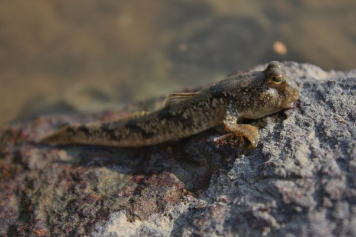

*Réponse publiée [sur Quora](https://fr.quora.com/Un-dinosaure-d%C3%A9couvert-le-c%C5%93lacanthe-est-vivant-de-nos-jours-mais-ne-se-transforme-pas-en-reptile-malgr%C3%A9-les-enseignements-scolaires-de-larbre-phylog%C3%A9n%C3%A9tique-ant%C3%A9rieurement-Pourquoi/answer/Dr-Goulu)*

vous avez du rater quelques "enseignements scolaires"…

- le [cœlacanthe](w:Coelacanthiformes)n'est pas un dinosaure, c'est un poisson .
- les cœlacanthes actuels ne sont pas forcément des descendants, ni de la même espèce que les fossiles retrouvés. Ils ont juste des squelettes ressemblants. Comme l'explique très bien Pierre Kerner dans cet article :

[http://ssaft.com/Blog/dotclear/?...](http://ssaft.com/Blog/dotclear/?post/2012/06/23/Un-bon-fossile-est-un-fossile-mort)

- l'évolution ne suit pas de direction. Elle adapte les espèces à leur environnement. Si les cœlacanthes sont bien dans l'eau, ils vont y rester tranquillement encore quelques millions d'années.
- il y a actuellement des dizaines d'espèces de poissons en train de s'adapter à la vie hors de l'eau, notamment les [périophtalmes](w:Periophthalmus) :

- les [reptiles](w:Reptile)sont apparus il y a 320 millions d'années environ alors que la [sortie des eaux](w:) des animaux a eu lieu il y a 430 millions d'années. Donc vous pourrez venir voir dans 100 millions d'années si le périophtalme est devenu quelque chose qui ressemble à un reptile, pas avant.
- les seuls descendants des dinosaures sont les oiseaux. Il y en a plus d'espèces que de mammifères, donc ils sont loin d'être éteints.
