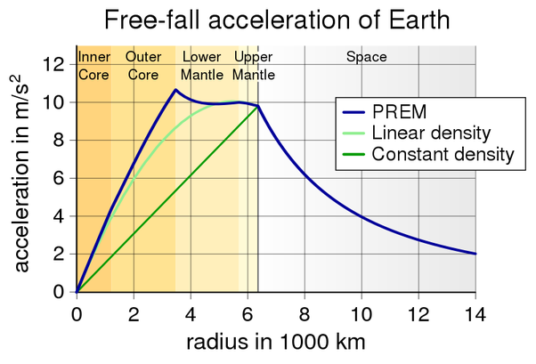

*Réponse publiée [sur Quora](https://fr.quora.com/Comment-%C3%A9volue-la-gravit%C3%A9-au-fur-et-%C3%A0-mesure-qu-on-s-enfonce-de-la-cro%C3%BBte-g981m-s%C2%B2-jusqu-au-centre-de-la-terre-g0/answer/Dr-Goulu)*

Comme ça (courbe bleue) :

Source : Dziewonski, A.M. (1981). "Preliminary reference Earth model". Physics of the Earth and Planetary Interiors 25: 297–356.
