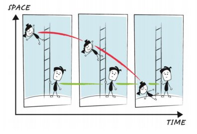

*Réponse publiée [sur Quora](https://fr.quora.com/Pourquoi-la-vitesse-sacc%C3%A9l%C3%A8re-t-elle-lorsque-quelque-chose-tombe-du-ciel/answer/Dr-Goulu)*

Puisque vous avez mis "relativité"* dans les sujets, je vais vous donner la réponse moderne à votre question.

L'objet qui tombe du ciel vers la Terre n'accélère pas quand il est hors de l'atmosphère**. Si vous étiez un astronaute dans un vaisseau spatial qui tombe, ou une fourmi extraterrestre dans une météorite, vous seriez en apesanteur...

Einstein a qualifié ceci d "idée la plus heureuse de sa vie" : les objets qui ne sont soumis qu'à la gravitation sont tous en chute libre ! Aucune accélération ne s'applique sur eux , donc aucune force non plus : la gravitation n'est pas une force !

Pourtant il est très clair que les objets tombent vers le sol avec une accélération (environ g=9.81 m/s^2 à la surface de la Terre).

Si ce n'est pas l'objet qui accélère vers le sol, il ne reste qu'une possibilité : c'est le sol qui "accélère" vers le haut !

Le [principe d'équivalence d'Einstein](w:Principe_d'équivalence) dit que la gravité est équivalente à une accélération du sol vers le haut. SI vous êtes enfermé dans une boite, il n'existe aucune expérience qui vous permet de distinguer ces deux situations :

Je vous remets la référence et la traduction à un très bon document trouvé en écrivant cette réponse :

[Réponse de Dr. Goulu à Comment le fait que l'espace soit courbé fait-il que la gravité nous tire vers le bas ?](/2020/2020-12-15-comment-le-fait-que-l-espace-soit-courbe-fait-il-que-la-gravite-nous-tire-vers-le-bas)

c'est un petit document du CERN[[1]](#iDKrt) emprunté au [Perimeter Institute](https://www.perimeterinstitute.ca/), donc pas n'importe qui…

Ce document répond en même temps à la question évidente : comment le sol peut-il accélérer vers le haut sans bouger vers le haut ? Je traduis la réponse donnée dans ce document tellement c'est BEAU :

> Regardons un scénario simple: Alice tombe d'une échelle tandis que Bob se tient en bas.

> Si nous esquissons le chemin d'Alice en tombant, nous voyons qu'elle trace une ligne COURBE et Bob trace une ligne DROITE. Cela a du sens pour nous parce que nous croyons en la force de gravité donc Alice devrait accélérer et Bob ne devrait pas bouger.
> En utilisant du ruban adhésif sur une surface plane, nous voyons qu'une ligne courbe sera froissée, et une ligne droite sera lisse, nous utiliserons cela comme définition pour "accélérer" et "ne pas accélérer".
>
>
>
> Selon Einstein, il n'y a AUCUNE FORCE de gravité! Alice devrait tracer une ligne droite tandis que Bob devrait tracer une ligne courbe parce que c'est lui qui accélère. Nous avons besoin un moyen pour Alice de tracer une ligne DROITE alors qu'elle tombe du haut de l'échelle au en bas et pour que Bob trace une ligne COURBE alors qu'il se tient au bas de l'échelle.
> La solution: dessinez l'image sur une surface courbe!

> La bande qui représente Alice est maintenant lisse donc DROITE, et la bande qui représente Bob est froissée (c'est-à-dire COURBE ). Nous avons réussi à montrer comment Alice peut tomber sans accélérer et Bob peut accélérer sans bouger! Tout ce que nous devons faire c'est changer la GEOMETRIE de l'espace-temps - la gravité n'est pas une force, c'est une courbure de l'espace-temps!
>
>
>
> Et regardez le haut des échelles sur votre ballon de plage. Que se passe-t-il si Alice reste sur l'échelle? Elle tracera un chemin plus court dans le temps que Bob. Or la relativité prédit que la gravité déforme le temps !! Cette prédiction est vérifiée chaque jour dans le système GPS.

La réponse courte à votre question est donc : l'objet n'accélère pas sous l'effet d'une force. Il se déplace en ligne droite dans l'espace-temps déformé par la Terre, et dans lequel la surface de la Terre se comporte comme si elle accélérait vers le haut à 9.81 m/s^2.

Notes
* vous aviez mis "relativité restreinte" mais la gravitation est du ressort de la "[relativité générale](w:)".

** et dans l'atmosphère il freine à cause du frottement, donc il accélère vers le haut, ce qui fait que les astronautes sont plaqués dans leur siège vers le bas.

Notes de bas de page

[[1]](#cite-iDKrt)[https://indico.cern.ch/event/507...](https://indico.cern.ch/event/507180/contributions/2197833/attachments/1312769/1965075/Summary_explanation.pdf)
