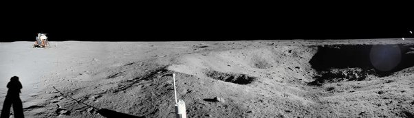

*Réponse publiée [sur Quora](https://fr.quora.com/Pouvez-vous-d%C3%A9crire-%C3%A0-quoi-ressemblerait-l-horizon-si-une-plan%C3%A8te-n-avait-pas-d-atmosph%C3%A8re/answer/Dr-Goulu)*

à ça :

(source [NASA](https://apod.nasa.gov/apod/ap190719.html))

Le fait que ce soir la Lune ne change rien : pas d'atmosphère = pas de diffusion de la lumière = horizon très net + ciel noir
