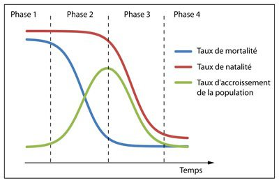

*Réponse publiée [sur Quora](https://fr.quora.com/Combien-serions-nous-dhumains-sur-Terre-si-on-navait-jamais-invent%C3%A9-la-vaccination-La-vaccination-a-t-elle-provoqu%C3%A9-une-r%C3%A9action-en-cha%C3%AEne-menant-au-r%C3%A9chauffement-climatique-ainsi-qu%C3%A0/answer/Dr-Goulu)*

La vaccination augmente l'espérance de vie, en diminuant notamment la mortalité infantile. Rien que la vaccination contre la rougeole évite la mort de plus d'un million d'enfants par année[[1]](#Evmsh) . Environ 400'000 personnes mouraient de la variole chaque année rien qu'en Europe à la fin du 18ème siècle[[2]](#NWwLp) .

La "défense" naturelle contre les maladies est de faire plus d'enfants. Le [taux de fécondité](w:) avant la médecine moderne était de 6 à 7 dont 2/3 mouraient avant d'arriver à l'âge adulte. Ce taux est de 2.4 environ actuellement.

Ce qui se passe pendant la [transition démographique](w:), c'est que l'espérance de vie augmente avant que la natalité ne descende :

(source [[3]](#KCmMT) )

L'accroissement de la population est donc plus du au "vieillissement" de la population qu'aux nouvelles naissances. Rosling explique ça de manière magistrale dans une conférence à voir absolument :

[https://www.youtube.com/watch?v=...](https://www.youtube.com/watch?v=2LyzBoHo5EI)

C'est difficile de faire la part des choses entre les effets de la vaccination, celle des antibiotiques et les progrès de l'agriculture qui ont évité quand même pas mal de famines, mais en gros ces grandes inventions du 20ème siècle (avec d'autres comme l'approvisionnement en eau potable) ont permis à la population mondiale de passer de 1.6 milliards en 1900 à 6.1 milliards en 2000[[4]](#kSqJu) , soit 4.5 milliards d'humains de plus.

3 humains sur 4 , vous compris, doivent la vie à cette extraordinaire transition. Et en plus vous vivez plus vieux, en meilleure santé, et vos enfants ne meurent que très rarement alors que c'était la règle avant. Pensez-y, bande de futurs vieux…

De plus, les milliards de gens qui vivaient dans l'ex "tiers-monde" en mode survie accèdent progressivement à la qualité de vie des "pays développés".

Personnellement je trouve que le réchauffement climatique et l'[extinction de l'Holocène](w:) (qui a commencé il y a 13'000 ans environ) sont un prix à payer acceptable pour ceci. Les 9 milliards de cerveaux qui vont me succéder trouveront un mode de vie "durable" pour le plateau de population qui suivra.

Notes de bas de page

[[1]](#cite-Evmsh)[Le retour en force de la rougeole, plus meurtrière que jamais](https://www.futura-sciences.com/sante/actualites/maladie-infectieuse-retour-force-rougeole-plus-meurtriere-jamais-18296/)

[[2]](#cite-NWwLp)[La variole](https://www.caducee.net/DossierSpecialises/infection/variole.asp)

[[3]](#cite-KCmMT)[Une brève histoire de la croissance démographique mondiale | Planète viable | Les résultats de la recherche en science du développement durable](https://planeteviable.org/breve-histoire-croissance-demographique-mondiale/)

[[4]](#cite-kSqJu)[Population mondiale de 1800 à 2050](https://www.monde-diplomatique.fr/cartes/1800-2050)
