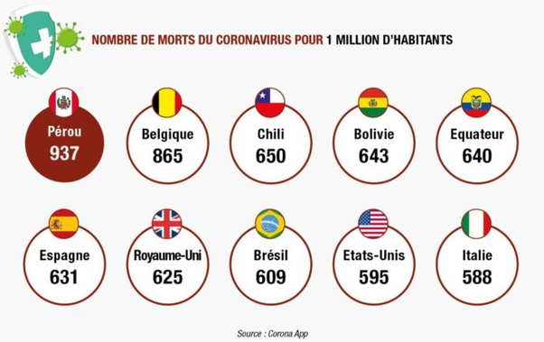

*Réponse publiée [sur Quora](https://fr.quora.com/Pourquoi-le-covid-19-touche-que-les-pays-occidentaux-Un-simple-hasard-Et-l-Am%C3%A9rique-du-Sud-Le-Br%C3%A9sil-Le-Chili-Le-P%C3%A9rou-Tous-ces-pays-l%C3%A0/answer/Dr-Goulu)*

Je ne comprends pas le sens de votre question. Vous voulez dire qu'ils sont moins touchés ou qu'on les oublie ?

Les pays d'Amérique de sud sont parmi les plus touchés par LA Covid 19 (parce que le D signifie "disease")

(chiffres de septembre 2020)

On ne le sait pas, ou on l'oublie, parce que chaque pays s'occupe en priorité de sa propre situation sanitaire, et qu'on ne peut hélas pas faire grand chose pour les autres.
