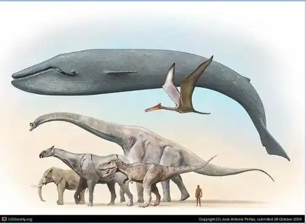

*Réponse publiée [sur Quora](https://fr.quora.com/Pourquoi-n-y-a-t-il-plus-d-animaux-aussi-grands-marchant-sur-terre-qu-%C3%A0-l-%C3%A9poque-des-dinosaures/answer/Dr-Goulu)*

En fait il faut remettre les choses en perspective. Il y a eu quelques espèces de dinosaures plus gros que les éléphants, et ils n'ont pas tous vécu en même temps.

Et la baleine bleue est le plus gros animal ayant vécu, dinosaures marins compris.

Donc il y a des animaux aussi grands, voire plus qu'à l'époque des dinosaures.

