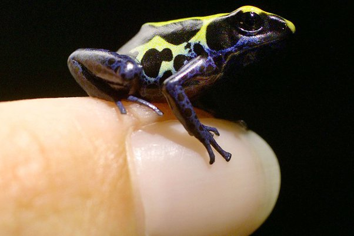

*Réponse publiée [sur Quora](https://fr.quora.com/Quel-animal-d-apparence-adorable-est-en-fait-dangereux-voire-mortel/answer/Dr-Goulu)*

Les grenouilles [dendrobates](w:Dendrobatidae). Elles sont si petites, si belles avec leurs jolies couleurs

Et pourtant extrêmement toxiques. Si on frotte leur peau et qu'on met la main à la bouche, on meurt.

J'en ai vu plein au Costa Rica, juste à côté de fourmis "bala"…

[https://fr.wikipedia.org/wiki/Pa...](w:Paraponera)
