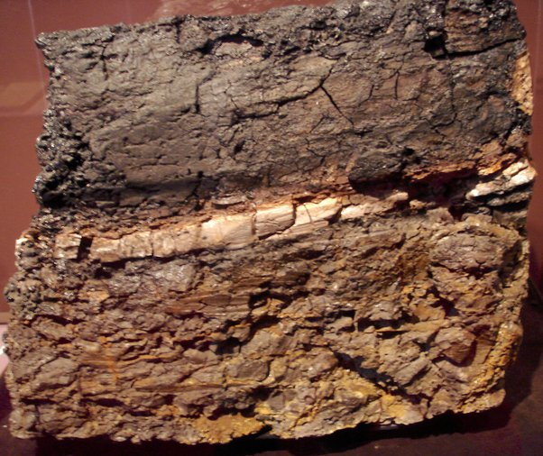

*Réponse publiée [sur Quora](https://fr.quora.com/Existe-t-il-des-preuves-sous-forme-de-photos-de-l-ast%C3%A9ro%C3%AFde-qui-a-d%C3%A9truit-les-dinosaures/answer/Dr-Goulu)*

> Une roche du Wyoming (États-Unis), avec une couche intermédiaire d'argile qui contient 1 000 fois plus d'[iridium](w:) que les couches supérieures et inférieures ; photo prise au musée d'histoire naturelle de San Diego.

[https://fr.wikipedia.org/wiki/Ex...](w:Extinction_Crétacé-Paléogène)
