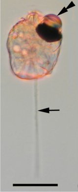

*Réponse publiée [sur Quora](https://fr.quora.com/Quel-est-le-plus-petit-%C3%AAtre-vivant-%C3%A0-poss%C3%A9der-la-vue/answer/Dr-Goulu)*

ça dépend de ce que vous appelez la vue, mais un des organismes les plus simples capable de s'orienter en fonction de la lumière est [Erythropsidinium](w:en:Erythropsidinium), un unicellulaire marin qui dispose d'une structure appelée "[ocelloïde](w:en:Ocelloid)", qui ressemble étrangement à un oeil (double flèche de la photo. La barre du bas est une échelle de 20 microns )

Les invertébrés ont des yeux très simples appelés [ocelles](w:Ocelle_(œil)) que l'on retrouve déjà chez la méduse et autres animaux marins très primitifs.

Ces yeux primitifs utilisent tous la [rhodopsine](w:), exactement la même molécule que celle qui se trouve dans les bâtonnets de notre rétine et de tous les autres animaux.
