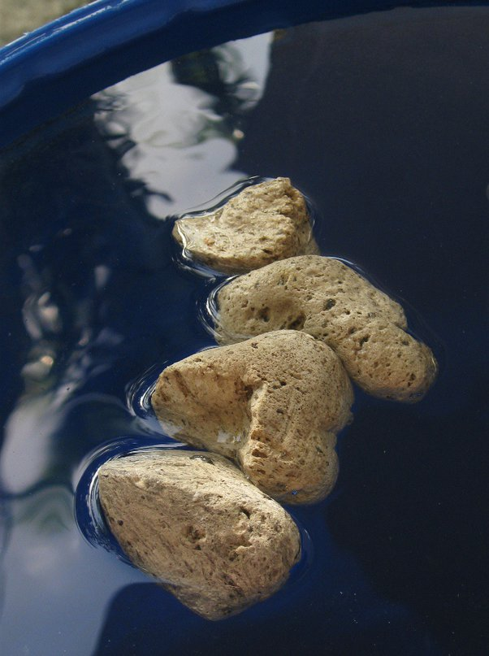

*Réponse publiée [sur Quora](https://fr.quora.com/Comment-un-bateau-flotte-t-il/answer/Dr-Goulu)*

il y a des cailloux qui flottent

oui, la pierre ponce est pleine de bulles d'air.

Un peu comme un bateau quoi …
