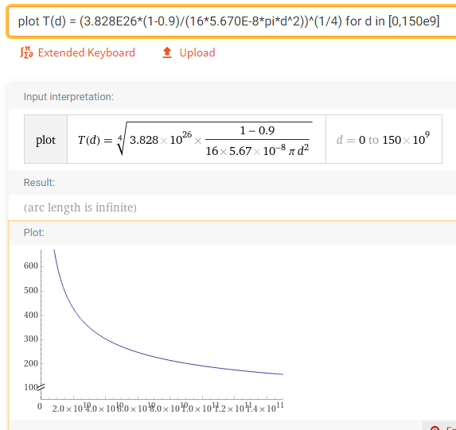
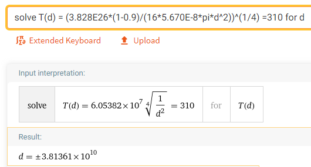

*Réponse publiée [sur Quora](https://fr.quora.com/%C3%80-quelle-distance-du-soleil-la-chaleur-serait-elle-fatale-pour-un-humain/answer/Dr-Goulu)*

C'est donné par l'équation

$${\displaystyle T_{\mathrm {eq} }={\left({\frac {L_{o}\left(1-a\right)}{16\sigma \pi d^{2}}}\right)}^{1/4}}$$

utilisée pour le calcul de la

[https://fr.wikipedia.org/wiki/Te...](w:Température_d'équilibre_à_la_surface_d'une_planète)

où $L_0$ est la luminosité du Soleil ($3,828 10^{26} W$), *σ* est la [constante de Stefan–Boltzmann](w:Constante_de_Stefan-Boltzmann), et d la distance de l'objet au Soleil.

La seule variable à choisir est $a$, l'[albedo](w:Albédo_de_Bond) qui définit la quantité de lumière réfléchie par l'objet. L'albedo de la peau humaine est d'environ 0.4, mais dans une combinaison blanche d'astronaute elle vaut plutôt 0.9.

En partant de l'idée que notre astronaute est en combinaison blanche, dans Wolfram Alpha ça donne ça :

où la courbe montre la température (en Kelvin) en fonction de la distance au Soleil, le point le plus à droite correspond à l'orbite terrestre.

On voit donc que non, on ne cuit pas sur Terre ni dans l'espace au niveau de l'orbite terrestre. Il fait plutôt très froid, [Benoît Morrissette](https://fr.quora.com/profile/Beno%C3%AEt-Morrissette) a encore oublié l'effet de serre, pour changer…

Le problème de notre astronaute dans sa combi c'est qu'il chauffe lui aussi, de l'intérieur, d'environ 200 watt quand il a une activité normale. Pour évacuer cette chaleur, il faut qu'il fasse plus froid dehors, donc qu'il fasse moins de 37°C environ, sinon sa combinaison ne pourra pas évacuer la chaleur produite par son propre corps et il va donc mourir de chaud.

Résolvons donc l'équation pour T=310 K :

on a donc ainsi la distance minimale au Soleil qui assure un possible refroidissement de l'astronaute : 38.136 millions de km

C'est même à l'intérieur de l'orbite de Mercure, qui est chaude parce qu'elle a un albedo très faible (0.088). Mercure est presque noire.
