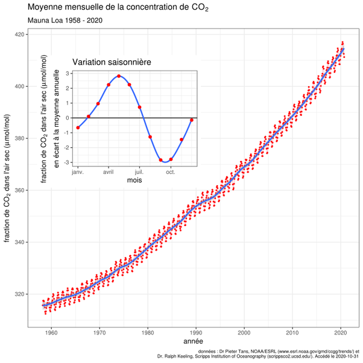

*Réponse publiée [sur Quora](https://fr.quora.com/Est-ce-que-les-images-satellites-confirmant-le-verdissement-de-la-plan%C3%A8te-suite-%C3%A0-l-augmentation-du-carbone-dans-l-atmosph%C3%A8re-ne-sont-pas-une-pierre-dans-le-jardin-du-GIEC-concernant-ses/answer/Dr-Goulu)*

Voici la mesure de la concentration de CO2 à Hawaï, au milieu du Pacifique histoire que l air soit bien brassé.

Vous voyez l'ombre de commencement de diminution de la croissance ? Moi non plus.

L'oscillation annuelle est due à la photosynthèse car la végétation plus importante dans l hémisphère nord provoque une baisse pendant l été ici.

Avec plus de végétation, cette oscillation a une amplitude plus importante. Vous la voyez ? Moi non plus.

Le verdissement de la planète est totalement négligeable par rapport à nos émissions. Le seul moyen de contrecarrer le réchauffement par la photosynthèse serait de fertiliser les océans en y ajoutant du fer.

On fera ça peut-être quand ce sera vraiment la catastrophe.
