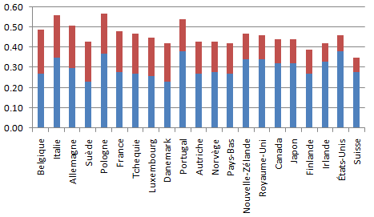

*Réponse publiée [sur Quora](https://fr.quora.com/L-%C3%89tat-peut-il-supprimer-les-in%C3%A9galit%C3%A9s/answer/Dr-Goulu)*

Les communistes ont essayé, ça n'a pas été un gros succès…

Il y a quelques années j'avais écrit ceci sur les inégalités

[https://www.drgoulu.com/2009/03/...](/2009/03/21/combien-dinegalite/)

Et produit ce graphique sur la réduction des inégalités produite par la fiscalité dans les pays de l'ocde :

La barre rouge montrant la différence entre les coefficients de gini avant et après impôts.
