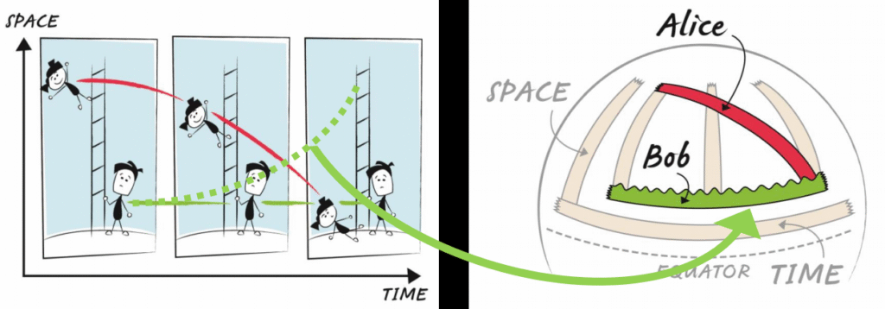

Les modèles scientifiques expliquent nos observations :

- Qu'est-ce qui fait qu'une tige se plie?
- Pourquoi une pomme tombe-t-elle?
- Pourquoi les objets ont-ils du poids?

La réponse commune à ces questions est "**la gravité**", une force mystérieuse qui attire les choses vers le sol. Dans ce modèle de force, les objets tombent parce qu'il y a une force agissant sur eux (la gravité) et les objets ont un poids car deux forces agissent sur eux (la gravité  
et la réaction "normale" du sol).

Dans quelle mesure avec vous confiance en cette explication? Est-ce que vous remettez en question une partie de ce modèle?

> Qu'un corps puisse agir sur un autre, à distance par le vide, sans la médiation de toute autre chose, par laquelle et par laquelle leur action et leur force peuvent être transmises de l'un à l'autre, est pour moi une si grande absurdité, que je ne crois pas d'homme qui ait en matière philosophique une faculté compétente  
> de penser, peut jamais y tomber.
> 
> Isaac Newton

Newton a révolutionné le monde quand il a montré que les lois du mouvement qui fonctionnent ici sur Terre décrivent aussi correctement le mouvement de la Lune et des planètes. Il ne pouvait pas expliquer comment la gravité fonctionnait, mais il pouvait prédire les orbites des planètes et c'était un exploit formidable. Cependant, ce fut un succès temporaire car à mesure que les observations l'ont amélioré, il est devenu clair que sa loi ne prédisait pas correctement les orbites… quelque chose clochait !!

Revenons aux questions d'origine. Existe-t-il une autre façon d’expliquer le «poids»,  
«Flexion» et «chute libre»?  
La réponse alternative à ces questions est ACCÉLÉRATION - facile si nous imaginons être  
une fusée dans l'espace, pas si facile pour le comportement sur Terre. Dans ce modèle d'accélération,  
il n'y a AUCUNE force de gravité agissant sur eux. Les objets tombent parce que le sol se précipite et  
les frappe. Les objets ont du poids parce que le sol se soulève à mesure qu'il accélère - il y a  
AUCUNE FORCE de gravité !!  
Comment ce modèle vous accompagne-t-il? Quel problème avez-vous avec cela?  
«J'étais assis sur une chaise à l'office des brevets de Berne, quand tout à coup une pensée m'est venue: si un  
la personne tombe librement, elle ne sentira pas son propre poids. J'ai été surpris. Cette simple pensée a fait une profonde  
impression sur moi. Cela m'a poussé vers une théorie de la gravitation ».Albert Einstein (pensée la plus heureuse)  
Comment la surface de la Terre peut-elle accélérer sans remonter?  
Examinons un scénario simple: Alice tombe d'une échelle tandis que Bob se tient en bas.  
Si nous esquissons le chemin d'Alice en tombant, nous voyons qu'elle trace une ligne COURBE et Bob  
trace une ligne DROITE. Cela a du sens pour nous parce que nous croyons en la force de  
gravité donc Alice devrait accélérer et Bob ne devrait pas bouger.  
En utilisant du ruban adhésif sur une surface plane, nous voyons qu'une ligne courbe est froissée et une ligne droite  
se trouve à plat, nous allons donc utiliser cela comme définition de l'accélération et non de l'accélération.  
Selon Einstein, il n'y a AUCUNE FORCE de gravité! Alice devrait tracer une ligne droite  
tandis que Bob devrait tracer une ligne courbe parce que c'est lui qui accélère. Nous avons besoin  
un moyen pour Alice de tracer une ligne DROITE alors qu'elle tombe du haut de l'échelle à la  
en bas et pour que Bob trace une ligne COURBE alors qu'il se tient au bas de l'échelle.  
La solution: dessinez l'image sur une surface courbe!  
La bande qui représente Alice reposera maintenant à plat (c.-à-d.  
STRAIGHT) et la bande qui représente Bob sera  
froissé (c'est-à-dire courbé). Nous avons réussi  
montrant comment Alice peut tomber sans accélérer et Bob  
peut accélérer sans bouger! Tout ce que nous devons faire c'est  
changer la GEOMETRIE de l'espace-temps - la gravité n'est pas un  
force c'est le gauchissement de l'espace-temps!  
Regardez le haut des échelles sur votre ballon de plage. Que se passe-t-il si Alice reste sur l'échelle?  
Elle tracera un chemin plus court dans le temps que Bob - la relativité prédit que la gravité  
déformer le temps !! Cette prédiction est élaborée chaque jour dans le système GPS.  
Les horloges atomiques des satellites GPS fonctionnent 45 microsecondes rapidement chaque jour car l'espace-temps  
est courbé différemment à une altitude de 20 000 km.

[https://indico.cern.ch/event/507180/contributions/2197833/attachments/1312769/1965085/Curved\_Spacetime\_in\_the\_Classroom.pdf](https://indico.cern.ch/event/507180/contributions/2197833/attachments/1312769/1965085/Curved_Spacetime_in_the_Classroom.pdf)

[https://indico.cern.ch/event/507180/contributions/2197833/attachments/1312769/1965075/Summary\_explanation.pdf](https://indico.cern.ch/event/507180/contributions/2197833/attachments/1312769/1965075/Summary_explanation.pdf)
