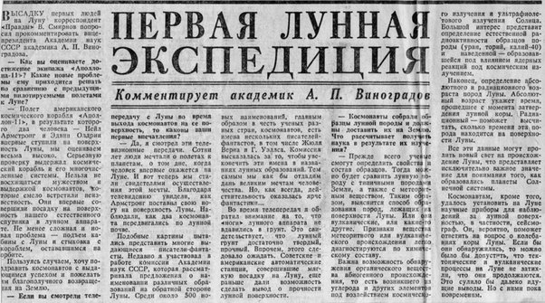

*Réponse publiée [sur Quora](https://fr.quora.com/Quelle-est-la-meilleure-preuve-que-l-homme-a-bel-et-bien-march%C3%A9-sur-la-Lune/answer/Dr-Goulu)*

Ca :

C'est la première page de la [Pravda](w:)du 22 juillet 1969, organe officiel du parti communiste soviétique. Le titre dit "première expédition sur la lune" et le sous-titre "commentaire de l'académicien [A.P. Vinogradov](w:Aleksandr_Pavlovitch_Vinogradov)" dans lequel il félicite les américains pour ce grand exploit.

Par la suite, il y a eu de nombreux autres articles dans la presse soviétique , et [Armstrong a été invité à Moscou](w:Neil_Armstrong) en mai 1970 où on ne lui a pas fait avouer que c'était un fake.

De la part des adversaires dans la course, qui avaient posé[Luna 9](w:) en 1966 sur la Lune (sans qu'aucun complotiste ne le conteste actuellement) et qui avaient les moyens techniques d'écouter toutes les communications depuis la Lune (et de les brouiller, ce qu'ils n'ont pas fait ), c'est très sport.
