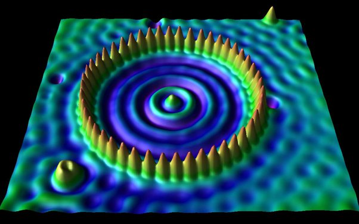

*Réponse publiée [sur Quora](https://fr.quora.com/Quelle-partie-de-l-atome-voit-on-dans-la-photo-montrant-les-caract%C3%A8res-IBM-cr%C3%A9%C3%A9s-avec-quelques-atomes/answer/Dr-Goulu)*

La couche électronique externe. D'ailleurs en disposant des atomes en cercle, on "voit" des choses étranges, qui sont les interférences entre les fonctions d'ondes des orbitales

