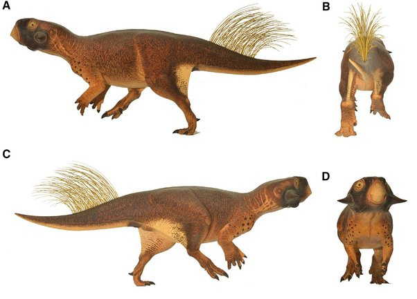

*Réponse publiée [sur Quora](https://fr.quora.com/Connait-on-la-ou-les-couleur-s-des-dinosaures/answer/Dr-Goulu)*

On en a quelque idée parce qu'on a trouvé des

[https://fr.wikipedia.org/wiki/M%...](w:Mélanosome)

fossilisés, notamment sur des dinosaures à plumes. (pour rappel les plumes sont des évolutions des écailles des dinosaures, et certains en avaient pour la parade et/ou intimider des adversaires, pas seulement chez les ancêtres des oiseaux )

L'article

[https://en.wikipedia.org/wiki/Di...](w:en:Dinosaur_coloration)

mentionne aussi un fossile de

[https://fr.wikipedia.org/wiki/Ps...](w:Psittacosaurus)

sur lequel on a trouvé assez de mélanosomes pour voir qu'il avait des rayures et des taches et qu'il devrait ressembler à ça :

Il n'y a pas vraiment de raison de penser que les dinosaures étaient moins colorés que la faune actuelle.
