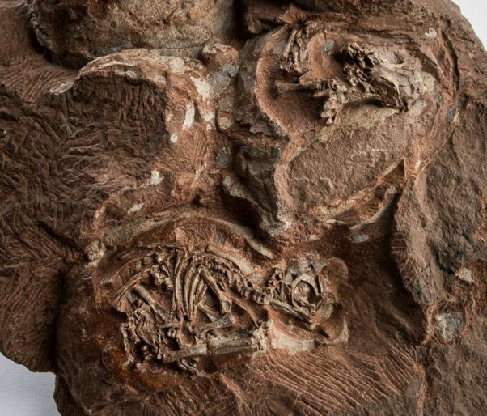
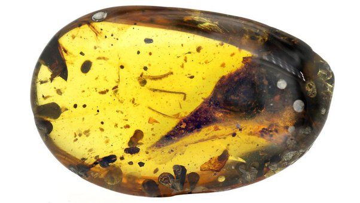
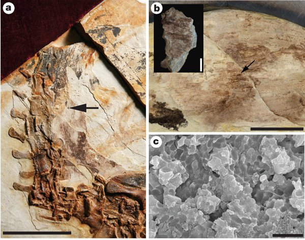

*Réponse publiée [sur Quora](https://fr.quora.com/Comment-les-gens-connaissent-ils-la-couleur-de-la-peau-des-dinosaures-s-ils-n-ont-trouv%C3%A9-que-des-os/answer/Dr-Goulu)*

qui vous a dit qu'on ne retrouve que des restes d'os ?

Regardez ça :

[https://www.nationalgeographic.c...](https://www.nationalgeographic.com/magazine/article/dinosaur-nodosaur-fossil-discovery)

on a trouvé de la peau, des plumes et d'autres organes fossilisés

[https://www.nature.com/articles/...](https://www.nature.com/articles/s41467-018-04443-x)

on a trouvé des œufs de dinosaures, avec les petits fossilisés dedans :

(source :

[https://www.futura-sciences.com/...](https://www.futura-sciences.com/planete/actualites/paleontologie-details-precedent-interieur-oeufs-dinosaures-fossilises-6843/)

)

On a même trouvé une tête complète d'[Oculudentavis](w:) fossilisée dans l'ambre :

La science moderne est pleine de ressources, et elles notamment capable de retrouver des

[https://fr.wikipedia.org/wiki/M%...](w:Mélanosome)

fossilisés comme expliqué dans cet article :

[https://www.nature.com/articles/...](https://www.nature.com/articles/nature08740)

J'ai trouvé le [pdf ici](https://www.researchgate.net/publication/41166443_Fossilized_melanosomes_and_the_colour_of_Cretaceous_dinosaurs_and_birds) , avec cette illustration montrant un exemple de mélanosomes fossilisés en c.

L'échelle (barre noire) fait deux microns, donc vous voyez qu'il ne faut pas vous fier aux apparences de vos mauvais yeux : les "restes d'os" sont beaucoup plus intéressants que vous ne pensez.

Bref, quand vous posez une question intéressante comme "Comment savoir de quelle couleur était la peau ou les écailles des dinosaures" abstenez vous svp de supposer des choses comme "lorsqu'on ne trouve que des restes d'os" quand vous ne connaissez pas le domaine…
