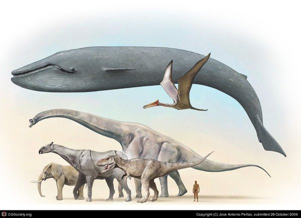

*Réponse publiée [sur Quora](https://fr.quora.com/Pourquoi-les-animaux-pr%C3%A9historiques-%C3%A9taient-ils-plus-gros-que-la-plupart-des-animaux-modernes/answer/Dr-Goulu)*

Ce n'est pas le cas. Il y a eu que quelques espèces particulièrement grandes, mais ce n'était pas une généralité et la baleine bleue est le plus grand animal qui ait jamais existé.

