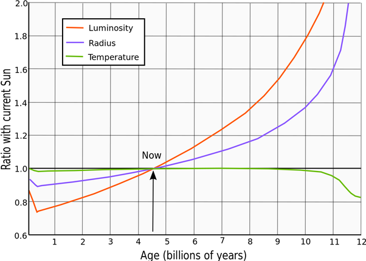

*Réponse publiée [sur Quora](https://fr.quora.com/On-dit-que-le-soleil-diminue-d1m-par-heure-mais-le-fait-quil-diminue-me-para%C3%AEt-bizarre-car-sur-les-10-derni%C3%A8re-ann%C3%A9es-son-diam%C3%A8tre-aurait-diminuer-de-8000km-environ-et-les-astronomes-en/answer/Dr-Goulu)*

qui dit ça ? référence siouplait…

L'évolution des étoiles du type du [Soleil](w:)est très bien connue et leur rayon **augmente**avec le temps, sauf tout au début.

Selon cette figure :

le rayon du Soleil augmente actuellement d'environ 10% en 2 milliards d'années.

Je divise le rayon du soleil par 10 puis par 2 milliards et j'obtiens 6.96265e8/10/2E9=0.03481325 mètres par an.

Le rayon du Soleil **augmente**de 3.5 centimètres par an.

Donc le "on" qui dit que le soleil diminue d'1m par heure a tout faux.

Mais c'est difficile à mesurer, je vous l'accorde.
