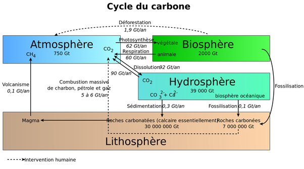

*Réponse publiée [sur Quora](https://fr.quora.com/Combien-de-CO2-l-oc%C3%A9an-absorbe-t-il/answer/Dr-Goulu)*

92 Gigatonnes par an.

Et il en renvoie 90 dans l'atmosphère et en dépose 0.4 au fond.

Donc 1.6 Gigatonnes par an provoquent l'[Acidification des océans](w:).

source : [Cycle du carbone — Wikipédia](w:Cycle_du_carbone)
