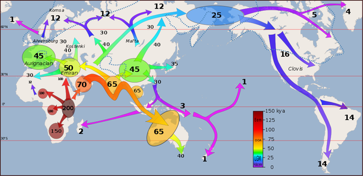

*Réponse publiée [sur Quora](https://fr.quora.com/%C3%80-partir-de-quand-et-comment-les-humains-se-sont-retrouv%C3%A9es-sur-diff%C3%A9rents-continents/answer/Dr-Goulu)*

L'[Expansion planétaire de l'Homme moderne](w:) a débuté par plusieurs "sorties d'Afrique" entre 220'000 et 50'000 ans avant notre ère.

Les passages vers l'Australie il y a 65'000 ans et vers l'Amérique il a 25'000 ans ont eu lieu pendant des glaciations, ou le niveau de la mer était environ 100m plus bas qu'actuellement.

Cette carte illustre notre vision actuelle de cette conquête :

