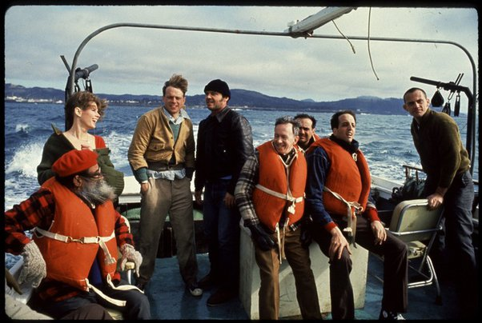

*Réponse publiée [sur Quora](https://fr.quora.com/Pouvez-vous-publier-une-photo-ou-une-vid%C3%A9o-de-la-sc%C3%A8ne-la-plus-m%C3%A9morable-de-votre-film-pr%C3%A9f%C3%A9r%C3%A9-et-nous-dire-pourquoi-vous-avez-choisi-celle-l%C3%A0/answer/Dr-Goulu)*

Un de mes films préférés est "[Vol au dessus d'un nid de coucou](w:Vol_au-dessus_d'un_nid_de_coucou)" et ma scène préférée est un peu avant celle-là, quand Nicholson monte sur le bateau de pêche avec sa bande de dingues échappés de l'asile (désolé, je ne sais pas comment dire ça en langage politiquement correct actuel … le groupe de pensionnaires de l'établissement pour déficients mentaux qu'il a motivés à le suivre dans une activité de découverte non encadrée ?)

Un gardien du port leur demande des explications et Nicholson les présente comme les psychiatres de l'institution. J'adore cette scène parce que ça m'est arrivé en visitant une institution où travaillait ma chérie : j'ai pris un éducateur pour un pensionnaire et vice-versa …
