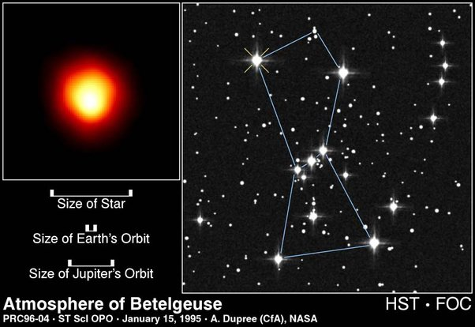

*Réponse publiée [sur Quora](https://fr.quora.com/Pourquoi-lorsque-les-astronomes-regardent-des-%C3%A9toiles-plus-brillantes-que-le-Soleil-%C3%A0-l-aide-de-t%C3%A9lescopes-surpuissants-ils-ne-sont-pas-%C3%A9blouis-par-la-lumi%C3%A8re-de-ces-%C3%A9toiles-lorsqu-ils/answer/Dr-Goulu)*

même en "zoomant" au maximum avec un télescope surpuissant, les étoiles sont rarement plus grosses qu'un point. Une des seules, si ce n'est la seule qui fasse plus d'un pixel de camera est [Bételgeuse](w:), qui est mille fois plus grosse que le Soleil. Voici sa [photo prise par le télescope spatial Hubble](https://hubblesite.org/contents/media/images/1996/04/394-Image.html) :

La [Magnitude apparente](w:)de Betelgeuse oscille entre +0.0 et +1, alors que celle du Soleil est de -26.7.

Or un point de magnitude correspond à une variation du flux lumineux d'un facteur 2.5 (racine 5ème de 100 pour être plus précis)

Donc la lumière que nous recevons de Betelgeuse est 2.5^26.7 = 42 milliards de fois moins puissante que celle que nous recevons du Soleil.

Comme nous recevons environ 1000 Watts par m2 de lumière solaire, ça signifie qu'un télescope ayant un miroir d' 1m2, ce qui est déjà un beau télescope, en recevra 1000/42E9 = 0.000000024 Watts.

Et avec le plus grand télescope du monde, le [Grand télescope binoculaire](w:)qui a deux miroirs totalisant 111m2 et qui fondrait littéralement si on le dirigeait vers le Soleil, on reçoit 2.6 microwatt de lumière.

C'est vraiment pas beaucoup, pourtant j'hésiterais à exposer ma rétine à ça, en effet. Mais heureusement, les astronomes ne regardent plus directement dans un oculaire, à part pour le plaisir. Les grands instruments sont tous équipés de caméras et d'appareils de mesure sophistiqués, et on regarde les résultats après traitement informatique sur un écran d'ordinateur, souvent très loin du télescope.
