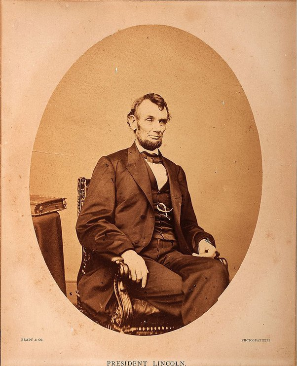
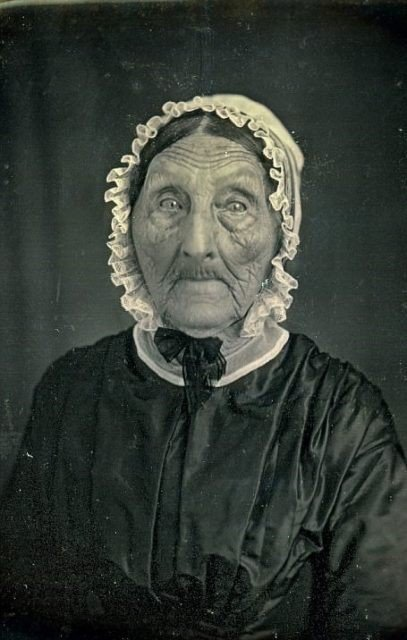

*Réponse publiée [sur Quora](https://fr.quora.com/Pouvons-nous-voir-une-photographie-de-la-personne-qui-est-n%C3%A9e-sur-la-date-la-plus-recul%C3%A9e-possible/answer/Dr-Goulu)*

Ca doit être une des personnes photographiées par [Mathew Brady](w:). Il y a bien sur sa fameuse photo de Lincoln, né en 1809 :

mais il a aussi fait en 1844 une série de photos de personnes très âgées, par exemple celle-ci:

Si cette dame a 90 ans, alors elle est née autour de 1750 …

[https://www.curioctopus.fr/read/...](https://www.curioctopus.fr/read/19782/voici-les-photos-de-la-plus-ancienne-generation-de-personnes-jamais-photographiee)
