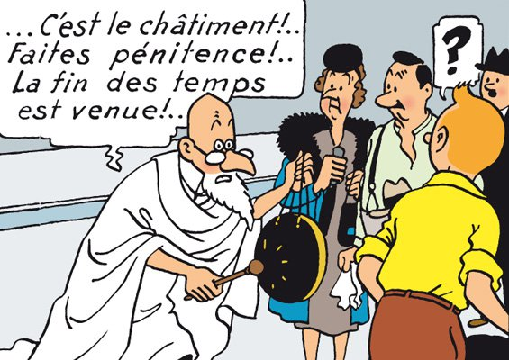

*Réponse publiée [sur Quora](https://fr.quora.com/En-quoi-la-fin-du-monde-est-elle-plus-s%C3%BBre-que-la-fin-du-capitalisme-pourquoi-certains-s-obstinent-ils-%C3%A0-nous-convaincre-pour-notre-bien-de-l-imminence-de-la-fin-du-monde-quand-la-cause/answer/Dr-Goulu)*

Remarquez que le professeur Callixte porte des verres de silice australienne avec des montures en aluminium brésilien, des vêtements en coton indien et frappe un tambour en peau de zébu de Madagascar cerclé de cuivre chilien avec une baguette de bois finlandais.

Ensuite allez dans tous ces pays expliquer aux gens qu'à cause du niveau de vie qu'ils ont atteint en nous vendant tous ces produits, ils vont causer la fin du monde, pour rire…
