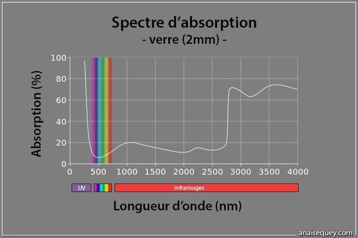

*Réponse publiée [sur Quora](https://fr.quora.com/Quelle-partie-des-rayons-du-soleil-p%C3%A9n%C3%A8tre-%C3%A0-travers-une-fen%C3%AAtre-en-verre/answer/Dr-Goulu)*

Coup de bol, le verre est très transparent aux longueurs d'onde du visible(environ 95% de transparence pour 2mm de verre) :

Il est aussi assez transparent (80-90%) aux infrarouges, mais très peu aux ultraviolets
