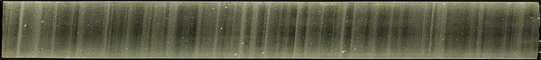

*Réponse publiée [sur Quora](https://fr.quora.com/Comment-les-scientifiques-savent-ils-de-quoi-%C3%A9tait-compos%C3%A9e-latmosph%C3%A8re-il-y-a-800-000-ans/answer/Dr-Goulu)*

Grâce aux bulles d'air retrouvées dans les

[https://fr.wikipedia.org/wiki/Ca...](w:Carotte_de_glace)

de l'Antarctique. Voilà à quoi ressemble cette glace vers 1837m de profondeur:

on voit nettement les couches annuelles de neige, et les petits points blancs sont des bulles dont on peut analyser la composition par [Spectrométrie de masse](w:).

De plus, on peut même obtenir la température global de l'atmosphère par le rapport isotopique de l'oxygène([16O](w:Oxygène_16) / [18O](w:Oxygène_18)) emprisonné dans les bulles : plus il fait chaud, plus il y a d'isotope lourd.

Il faut quand même faire un peu attention à la datation des bulles car elles migrent vers le haut dans la glace, très lentement mais surement.
