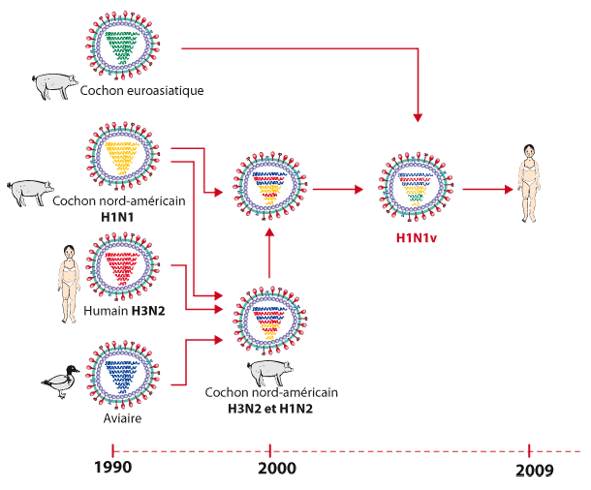

*Réponse publiée [sur Quora](https://fr.quora.com/Est-il-probable-que-la-Covid-19-mute-chaque-ann%C3%A9e-comme-la-grippe-faisant-un-vaccin-annuel-n%C3%A9cessaire/answer/Dr-Goulu)*

Petit rappel des faits.

"LA" [Grippe](w:), c'est en réalité 4 virus distincts, qui touchent aussi les oiseaux et certains mammifères dont le cochon. Tous ces virus se combinent parfois joyeusement dans les mêmes cellules et produisent de nouvelles souches qui se transmettent parfois à l'homme. Voici par exemple une hypothèse sur la genèse du virus pandémique 2009 ()

(Source : Trifonov et al. N Eng J Med 2009, 361:115-119 sur [UCLOUVAIN FDP Virologie](https://www.virologie-uclouvain.be/fr/chapitres/exemples-choisis/virus-de-la-grippe) )

La nature saisonnière de la grippe n'est pas encore totalement comprise, mais il est possible que ça soit lié aux migrations des oiseaux, à la température , à la saison de la choucroute où on mange du cochon, ce genre de trucs.

Pour les [Coronavirus](w:)aussi, il y a aussi 4 virus [229E](w:Coronavirus_humain_229E), [NL63](w:Coronavirus_humain_NL63), [OC43](w:Coronavirus_humain_OC43) et [HKU1](w:Coronavirus_humain_HKU1) qui infectent l'homme depuis longtemps. Ils seraient la cause de 15 à 30 % des rhumes courants, peut-être parce que nous avons développé une immunité efficace après des pandémies anciennes et oubliées …

Mais il y a aussi 500 coronavirus distincts qui infectent les chauve-souris, qui sont apparemment des "porteurs sains" de la plupart et nous infectent occasionnellement en passant par un autre mammifère vu que nous ne consommons pas directement des chauve-souris (sauf aux Seychelles, j'ai goûté, c'est pas terrible…)

Ce mécanisme s'est produit récemment 3 fois :

1. le [SARS-CoV](w:), [agent pathogène](w:) du [syndrome respiratoire aigu sévère](w:) (SRAS) en [2002-2004](w:Épidémie_de_SRAS_de_2002-2004)
2. le [MERS-CoV](w:Coronavirus_du_syndrome_respiratoire_du_Moyen-Orient), celui du [syndrome respiratoire du Moyen-Orient](w:Coronavirus_du_syndrome_respiratoire_du_Moyen-Orient) à partir de [2012](w:)
3. le [SARS-CoV-2](w:) actuel

Mais personne n'exclut qu'il se soit produit des événements similaires avant. D'ailleurs je viens de trouver ceci sur [Coronavirus humain NL63 — Wikipédia](w:Coronavirus_humain_NL63) à propos du NL63 (mentionné plus haut, qui provoque de petits rhumes:

> HCoV-NL63 est l'une des six espèces de coronavirus (*Alpha-* et *Beta-*) connues pour infecter les humains, avec [HCoV-229E](w:Coronavirus_humain_229E), [HCoV-OC43](w:Coronavirus_humain_OC43), [HCoV-HKU1](w:Coronavirus_humain_HKU1), [MERS-CoV](w:Coronavirus_du_syndrome_respiratoire_du_Moyen-Orient) et [SARSr-CoV](w:Coronavirus_lié_au_syndrome_respiratoire_aigu_sévère) ([SARS-CoV](w:), [SARS-CoV-2](w:)). Il est estimé qu'il a divergé par rapport à HCoV-229E pendant environ 1000 ans: il a donc probablement circulé chez l'homme pendant plusieurs siècles

Le SARS-CoV-2 mute à peu près autant que les grippes et produit en effet pas mal de [Variants du SARS-CoV-2](w:), mais ce ne sont pas des virus différents et ils ne se combinent pas dans plusieurs hôtes avec d'autres coronavirus comme les grippes, à ce qu'on sache.

Peut-être qu'il faudra adapter une ou deux fois les vaccins à des nouveaux variants. Avec les vaccins à ARNm ça ira très vite.

Peut-être que l'immunité naturelle et artificielle que nous développons actuellement sera suffisamment générale pour que ces variants ne produisent que de petits rhumes comme NL63 et ses cousins.

Et peut-être que non, et que, comme les grippes, il faudra administrer des vaccins périodiquement, du moins aux personnes "à risque". Comme pour les grippes

L'avenir le dira. C'est ce qu'il y a de chouette avec l'avenir, il est plein de choses à découvrir.
