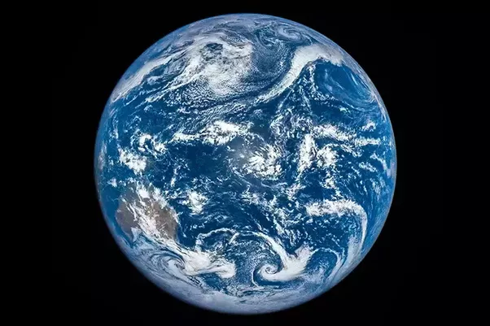

*Réponse publiée [sur Quora](https://fr.quora.com/A-quoi-ressemble-la-Terre-depuis-la-Lune-lors-d-une-%C3%A9clipse-lunaire-totale-Lune-de-sang/answer/Dr-Goulu)*

à peu près aux images prises par le satellite [Deep Space Climate Observatory](w:) lors de l'éclipse du 8 mars 2016

L'éclipse n'est totale que vue depuis le centre de la tache noire. dans la zone "sombre" elle n'est que partielle.
