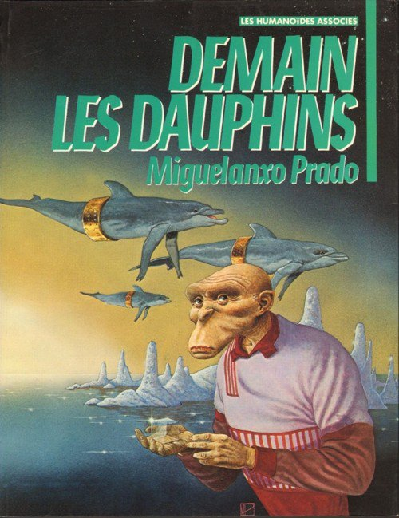

*Réponse publiée [sur Quora](https://fr.quora.com/Quel-genre-de-vie-pourrait-habiter-le-monde-apr%C3%A8s-les-humains/answer/Dr-Goulu)*

A l'époque de la Guerre Froide, un copain biologiste disait:

> La femme est l'avenir de l'homme, et le scorpion est l'avenir de la femme parce qu'il supporte encore mieux la radioactivité.

Mais c'est un pessimiste…

En tant qu'optimiste, j'aime cette BD géniale mais difficile à trouver :

La version pessimiste de Werber n'est pas mal non plus, et disponible partout.

