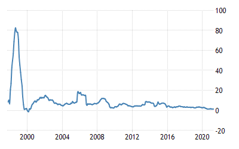

*Réponse publiée [sur Quora](https://fr.quora.com/Comment-investir-son-argent-quand-linflation-est-%C3%A9lev%C3%A9e/answer/Dr-Goulu)*

Dans une [Valeur refuge](w:), qui peut prendre une forme étonnante

Mon employeur produit des machines pour l'industrie de l'emballage qui valent plusieurs centaines de milliers d'euros, qui ont une bonne réputation sur le marché et une longue durée de vie.

Un jour nous en avons livré une en Indonésie, à un client inconnu qui l'a payée d'avance, et nous n'en avons plus entendu parler, ni pour l'installation, la mise en service ou la formation de ses opérateurs. Étrange.

Quelques mois plus tard, un commercial qui passe dans la région se dit qu'il va au moins faire connaissance du client par politesse, mais à l'adresse indiquée il ne trouve pas une fabrique de carton mais un club de golf.

Il se renseigne et le propriétaire du golf vient lui dire que oui, c'est bien lui qui a acheté la machine et il la lui montre dans le hangar des tondeuses à gazon, toujours intacte et démontée dans son énorme caisse de transport format container de marine.

Le client explique que vu l'inflation, il cherchait un placement sur qu'il pourrait garder chez lui pour quelques mois ou années, et revendrait la machine après. Notre commercial lui demande : mais pourquoi pas de l'or ? Le client : votre machine est moins facile à voler…

En regardant le taux d'inflation en Indonésie, je me rappelle la date 1998 ou 1999.

