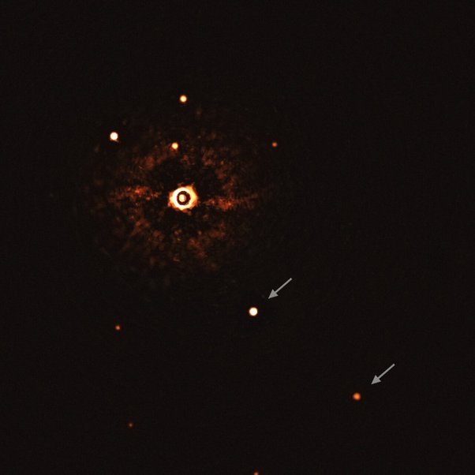

*Réponse publiée [sur Quora](https://fr.quora.com/Des-t%C3%A9lescopes-plus-perfectionn%C3%A9s-permettront-ils-un-jour-de-voir-m%C3%AAme-sans-pr%C3%A9cision-extr%C3%AAme-directement-toutes-les-plan%C3%A8tes-qui-se-trouvent-dans-les-syst%C3%A8mes-plan%C3%A9taires-de-notre/answer/Dr-Goulu)*

Oui. D'ailleurs on a déjà des observations directes d'exoplanètes, notamment par l'instrument [SPHERE](w:)installé au Chili.

Voici par exemple une image de l'étoile [TYC 8998-760-1](w:)avec deux de ses planètes géantes.

L'[Imagerie directe](w:)est un domaine en plein développement. On espère que la prochaine génération de télescopes spatiaux comme [Habitable Exoplanet Observatory](w:) sera capable de distinguer des océans, des calottes glaciaires, et bien sûr, de mesurer la composition de l atmosphère de ces exoplanètes par spectroscopie.

Évidemment, ça ne marchera que pour des planètes proches, au début…
