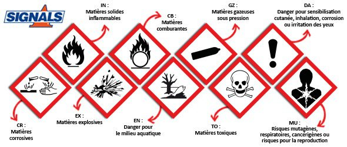

*Réponse publiée [sur Quora](https://fr.quora.com/Existe-t-il-un-type-de-pain-qui-soit-globalement-sain-pour-la-plupart-des-gens-Quel-est-ce-pain-et-o%C3%B9-peut-on-l-acheter/answer/Dr-Goulu)*

Tous les produits en vente libre sur lesquels ne figurent pas un ou plusieurs de symboles ci-dessous sont "globalement sains pour la plupart des gens".

Mais faites quand même attention avec le [monoxyde de dihydrogène](https://culturesciences.chimie.ens.fr/thematiques/chimie-et-societe/sante/le-monoxyde-de-dihydrogene-un-danger-meconnu), souvent mal étiqueté.
