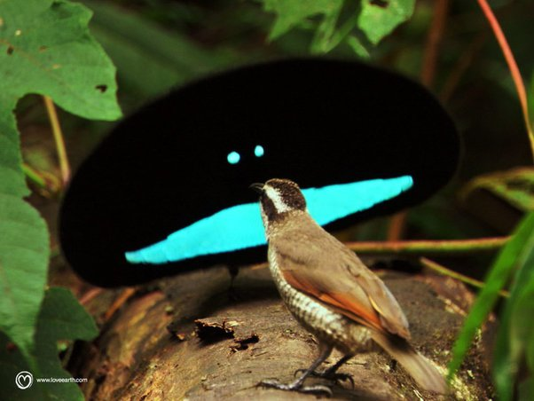

*Réponse publiée [sur Quora](https://fr.quora.com/Existe-t-il-des-tissus-ayant-le-m%C3%AAme-degr%C3%A9-d-absorption-que-le-Vantablack/answer/Dr-Goulu)*

Non, mais des plumes d'oiseau oui.

je ne parle pas de la terne femelle qui est devant, mais du smiley qui lui fait la cour.

Ce sont des [Paradisiers noirs](w:Paradisier_noir). Si on veut chipoter, leur plumage n'absorbe que 99.95% de la lumière alors que le [Vantablack](w:) c'est 99.985%

En video :


